# 【3d-game-hw4】打飞碟unity小游戏

## 1 游戏简介

1. 点击在飞的南瓜或者鸟来得分，点一个得一分，一视同仁；
2. 有两种模式：运动学/物理学飞行，物理学飞行即isKinematic ==false，飞行物体有碰撞效果；
3. 每一局限时30s，有最高得分记录。

## 2 Assets架构与各文件说明

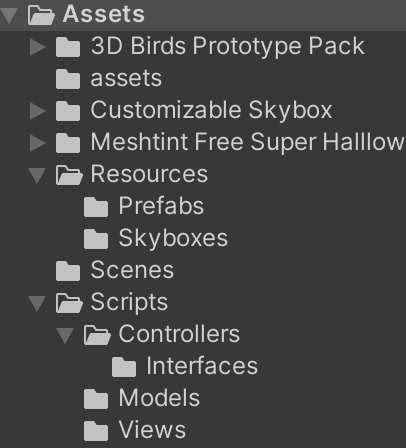

- #### Resources: Prefabs里是3种飞的东西，Skybox里是不同模式的天空，便于区分。

  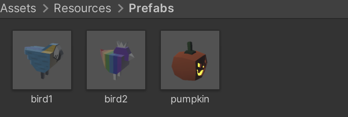

  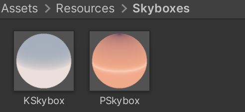

  - 用到的免费素材来自于与Resources文件夹同级的另外3个文件夹内，都是官网free assets。

- #### Scenes: samplescene里的firstcontroller挂载脚本作为入口。

  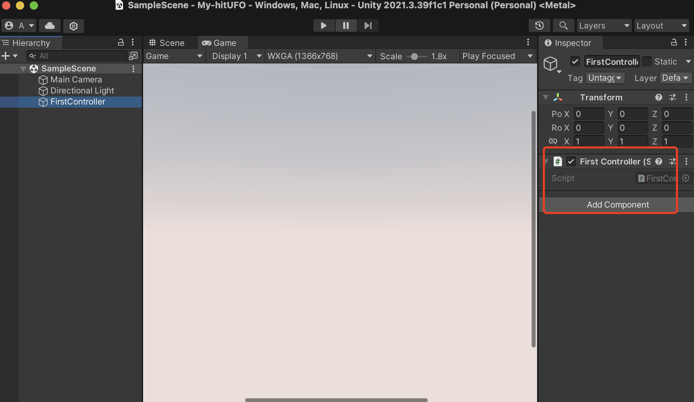

- #### Scripts: 控制游戏逻辑的脚本，尽量使用MVC结构：


​	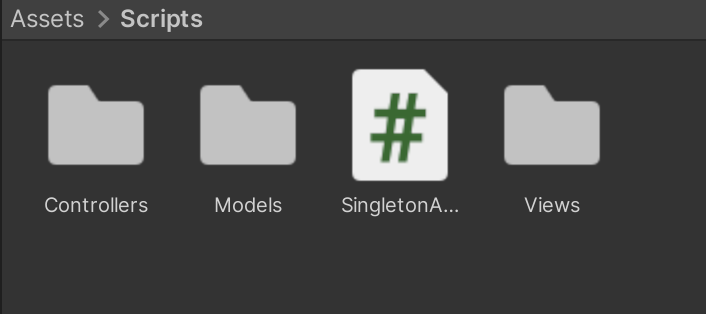

- **SingletonAutoMonoBase: 单例模式基类**

  ```c#
  using System.Collections;
  using System.Collections.Generic;
  using UnityEngine;
  
  public class SingletonAutoMonoBase<T> : MonoBehaviour where T : MonoBehaviour
  {
      private static T instance;
      public static T Instance
      {
          get
          {
              if (instance == null)
              {
                  GameObject obj = new GameObject();
                  obj.name = typeof(T).ToString();
                  DontDestroyOnLoad(obj); // 支持跨scene
                  instance = obj.AddComponent<T>();
              }
              return instance;
          }
      }
  }
  ```

- **Controller：**

  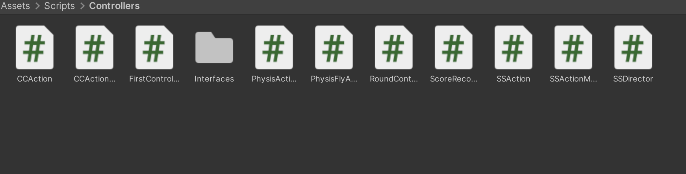

  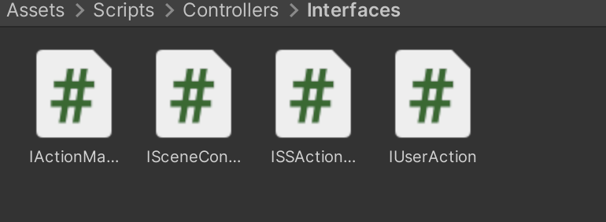

- **Model：使用了对象池管理飞行物**

  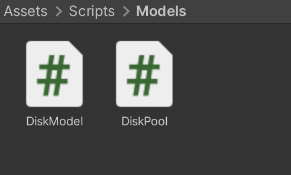

- **View：用户交互逻辑实现**

  - UserGUI：用户界面类，负责渲染游戏的 UI 元素，包括剩余时间、提示信息和游戏规则等。

    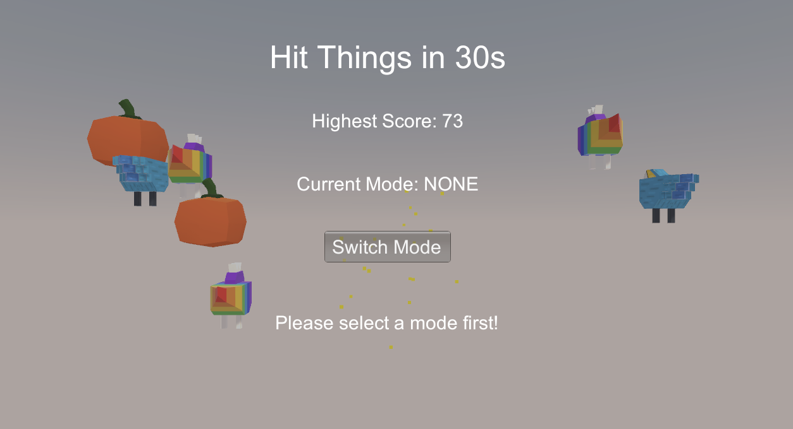

    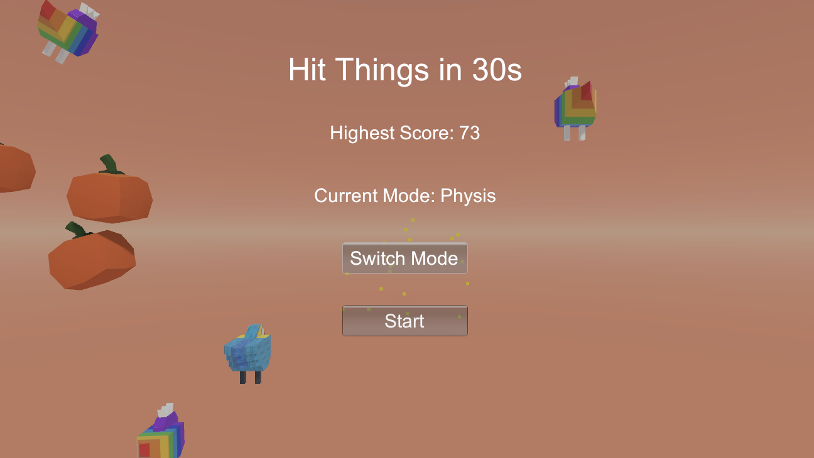

    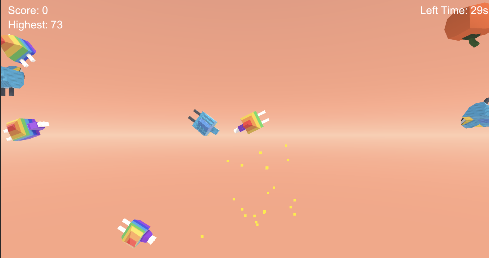


## 3 游戏脚本UML图

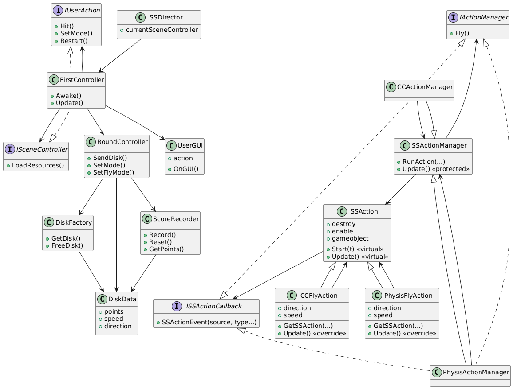

## 4 游戏演示视频与创新点

https://www.bilibili.com/video/BV1HCU7Y7EPP

对鼠标做了粒子系统追踪，提升玩家在点击时的体感。